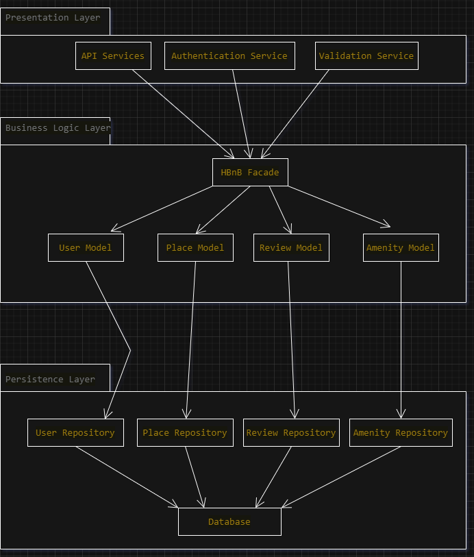

#  HBnB Backend Technical Documentation

---

## 1. Introduction

This document provides a comprehensive technical blueprint for a simplified version of an Airbnb-like application, named HBnB Evolution. The application will allow users to perform the following operations.
- User registration and authentication.
- Place creation and management.
- Review system.
- Amenity association.
---

## 2. High-Level Architecture

### 2.1 Package Diagram
> 

### 2.2 Layered Architecture
- **Presentation Layer (API)**: Handles HTTP requests/responses, performs early validation, and communicates with the facade.
- **Business Logic Layer (Facade and Models)**: Implements core logic, rules, and interaction between entities.
- **Persistence Layer (Repositories)**: Responsible for saving, updating, and retrieving user data.

---

## 3. Business Logic Layer

### 3.1 Class Diagram
> 

### 3.2 Entity Overview

- **BaseModel**
  - Unified logic for all models
  - Attributes: `id`, `created_at`, `updated_at`
  - Methods: `save()`, `update()`, `delete()`

- **User**
  - Attributes: `email`, `password`, `first_name`, `last_name`
  - Methods: `hash_password()`, `validate()`
  - Relationships: Aggregates `Place`, Aggregates `Review`
  - one to many with `Review` and `Place`

- **Place**
  - Attributes: `title`, `price`, `location`, `owner_id`
  - Relationships: Composed of `Review`, Aggregates `Amenity`
  - one to many with `Review` and many to many with Amenity

- **Review**
  - Attributes: `rating`, `comment`, `user_id`, `place_id`
  - Written by `User`, Composed into `Place`

- **Amenity**
  - Attributes: `name`, `description`
  - Many-to-many with `Place`

### 3.3 Relationship Types

- `User ◆── Place` (Composition)
- `Place ◆── Review` (Composition)
- `User ◆── Review` (Composition)
- `Place ◇── Amenity` (Aggregation)

**Justification:**
- Composition enforces entities like `Review` and `Place` owned by users cannot exist without `User`
- Aggregation indicates that `Amenity` can exist without a `Place`.

---

## 4. API Interaction Flow

### 4.1 Sequence Diagram — User Registration
> 

1. User sends a `POST /users` request. 
2. API validates the request's fields.
3. Facade creates a `User`.
4. `User` object is instantiated and validated.
5. Password hashed.
6. `User.save()` method called
7. Result returned in dictionary and then converted to JSON by `jsonify()` .

### 4.2 Sequence Diagram — Place Creation
> 

1. User sends `POST /reviews` request.
2. API checks user's token and validates.
3. Facade selects `Place`, verifies ownership.
4. `Review` object created and validated.
5. `save()` commits to user repo.
6. `jsonify()` response returned .

---
### 4.3 Sequence Diagram — Review Submission
> 

1. The client sends a `POST /<place_id>/reviews` request, including `review_data.
2. API checks user's token and validates.
3. API validates the rating and comment of the user.
4. The API calls the facade method: `create_review(review_data, user_id, place_id)`.
5. Facade selects `get_place(place_id)` method to ensure the place exists then review object is created.
6.  `Review model`validates rating (1-5) and sets `user_id` and `place_id` in the object.
7. `save()`commits to the review repo and inserted to database
8. A success or error status is returned from the database.
9. `jsonify()` response returned  to the client

---
### 4.4 Sequence Diagram — Fetching a List of Places:
> 

1. The client sends a `GET /places` request.
2. API parses the filters and calls `get_all_places(filters)` on the facade.
3. Facade forwards filters to the Place Model via `apply_filters()`.
4. Place Model calls `find_all()` in the repository with criteria.
5. Repository queries the database and returns matching place records.
6. Place Model loads related amenities and builds Place objects.
7. Facade returns the list to the API.
8. API formats the response (e.g., pagination) and sends it to the client.

## 5.  Validation and Data Integrity

### 5.1 API-Level Validation
- Checks for required fields
- Token validity
- Email and password structure

### 5.2 Model-Level Validation
- `User.validate()`: uniqueness, password rules
- `Review.validate()`: rating within bounds, required text

### 5.3 Password Handling
- `hash_password()` using secure algorithms
- `verify_password()` during login

---

## 6. Persistence Logic

### 6.1 `save()` Method
- Defined in `BaseModel`
- Updates timestamps and commits to in-memory store or JSON file

### 6.2 Repository Layer
- Abstract layer to simulate real DB operations
- Supports extending to SQL or NoSQL
## 👥 Authors

- **Saleh Alharbi**  
  [@SalehFulayyih](https://github.com/SalehFulayyih)  

- **Ahmed Aljuhani**  
  [@Ahmadmosadq1](https://github.com/Ahmadmosadq1)  
  

- **Osama Alghamdi**  
  [@osamaghamdi](https://github.com/[osamaghamdi](https://github.com/osamaghamdi))  

